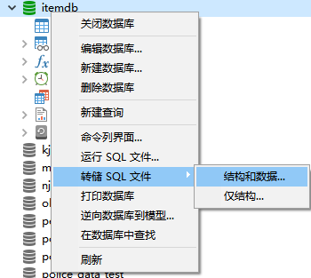
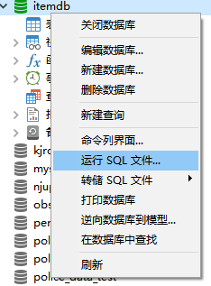
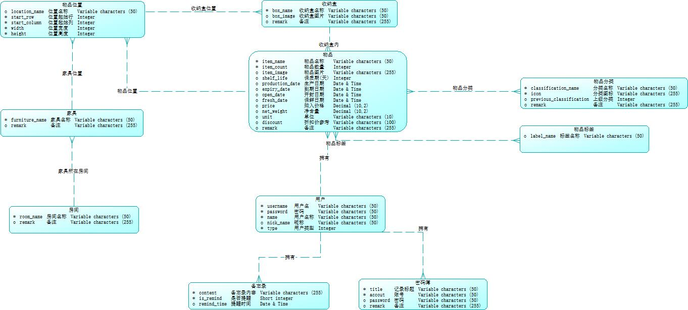
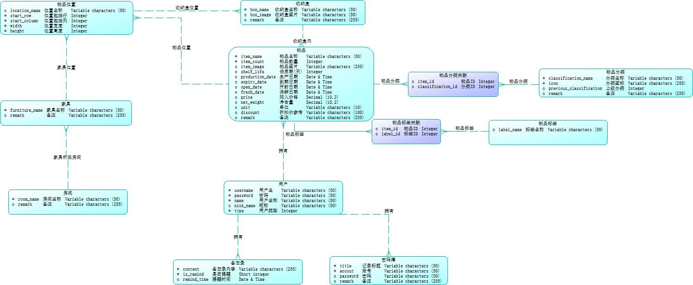
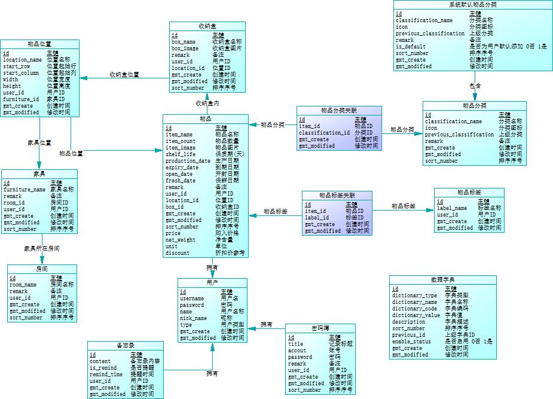

# 数据库设计说明书
[TOC]

## 1引言

### 1.1编写目的
本数据库设计说明书是“个人物品管理”（暂定名）的后端数据库的设计说明，作为看后端开发前的数据库资料，读者为后端开发人员，测试人员，系统维护人员。

### 1.2背景
1. 数据库使用MySQL数据库开发，版本为8.0，暂定数据库名为itemdb；开发过程中使用Navicat12连接数据库开发。
2. 该软件的任务提出者为Kay（开发人员），用户暂时也只有Kay，数据部署在开发本机，由于该本机不能通过外网连接数据库，开发人员会定期将数据库转储上传到Github仓库。

### 1.3定义
数据库：用来保存系统数据的后台应用软件。
字段：表中各个记录的名字。
表：不同字段汇总成的集合。
item：系统简称，作为数据表前缀。
Kay：项目开发负责人，即作者。
E-R图：数据库实体-关系图。
CDM图：概念结构设计图。
LDM图：逻辑结构设计图。
PDM图：物理结构设计图。

### 1.4参考资料
1. 本系统的软件需求说明书，https://github.com/kimikudo/my-own-items-back/blob/master/documents/%E8%BD%AF%E4%BB%B6%E9%9C%80%E6%B1%82%E8%AF%B4%E6%98%8E%E4%B9%A6.md
2. 数据库设计说明书（GB8567——88），文档模板。

## 2外部设计

### 2.1标识符和状态
数据库连接地址：192.168.2.146:3306
数据库名称：item_data
用户名：root
密码：123456
权限：root（所有）
有效期：开发阶段
说明：数据库目前部署在开发环境的本地，外部无法访问，持续至开发完成；开发完成后会连同项目一期部署于云服务器，由于外网无法访问，所以会定期将数据库转储备份，并上传仓库。

### 2.2使用它的程序
使用该数据库的仅项目后端，其他应用不连接此数据库。

### 2.3约定
1. 数据表及字段命名规则遵循`阿里巴巴Java开发手册`[阿里巴巴Java开发手册（泰山版）][12ca3aa1]的命名规范；
2. 该项目的数据表中，业务相关表使用`item`作为前缀，系统管理相关表使用`sys`作为前缀；转储的数据库文件的命名格式为`[tablename]_[date]`；
3. 数据表第一个字段为`id`，作为数据表主键，不可为空，自增；
4. 数据表中布尔类型字段类型为`tinyint`，日期时间字段类型为`datatime`，字符串类型为`varchar`且必须明确字段长度；
5. 数据库中的测试数据尽量符合实际情况或使用名称等字段简单标注数据功能，避免出现错误数据或歧义数据。

  [12ca3aa1]: https://github.com/alibaba/p3c/blob/master/%E9%98%BF%E9%87%8C%E5%B7%B4%E5%B7%B4Java%E5%BC%80%E5%8F%91%E6%89%8B%E5%86%8C%EF%BC%88%E6%B3%B0%E5%B1%B1%E7%89%88%EF%BC%89.pdf "阿里巴巴Java开发手册（泰山版）"

### 2.4专门指导

向准备从事此数据库的生成、从事此数据库的测试、维护人员提供专门的指导，例如将被送入数据库的数据的格式和标准、送入数据库的操作规程和步骤，用于产生、修改、更新或使用这些数据文卷的操作指导。如果这些指导的内容篇幅很长，列出可参阅的文件资料的名称和章条。
1. 转储数据库
对数据库进行备份时，只需使用前面的工具连接数据库，将数据库进行转储即可，同时按照规定格式对转储的sql文件进行命名

2. 运行数据库
如需运行sql文件将数据表及数据导入，则直接在要导入的数据库中选择“运行SQL文件”即可

3. 添加/修改/删除数据
维护及测试人员在不了解业务逻辑的前提下，简易使用项目前端或swagger添加/修改/删除数据；在了解业务的情况下，需确保数据的修改不影响项目的使用，不会出现异常情况，如数据缺失，关联丢失等。

### 2.5支持软件
数据库软件：MySQL 8.0
数据库连接软件：Navicat 12

## 3结构设计
本部分设计若因实际开发中需要或需求变更等原因发生变化，需及时修改文档内容。
### 3.1概念结构设计

本数据库实体主要有物品，收纳盒，摆放位置，家具，房间，物品分类，物品标签；用户，用户密码簿，用户备忘录等，其中各自实体，实体属性，实体间的关系由下图CDM图所示，

一般，每个实体均代表数据库中的一张表，存在自己的键；实体间的关系根据一对一，一对多，多对多的情况，决定其为实体属性关联还是关联表关联。

### 3.2逻辑结构设计

根据CDM图，进一步分解实体间的关系及实体和关系属性，形成如下LDM图

### 3.3物理结构设计

根据CDM图，LDM图，进一步确定实体的属性和关系属性，增加数据表必需字段，建立实体关系，确定多对多关联表和一对多关联字段，同时添加系统管理所需的辅助表，最终生成如下PDM图，确定数据表结构。

## 4运用设计

### 4.1数据字典设计

对数据库设计中涉及到的各种项目，如数据项、记录、系、文卷、模式、子模式等一般要建立起数据字典，以说明它们的标识符、同义名及有关信息。在本节中要说明对此数据字典设计的基本考虑。
####数据表清单
| 名称             | 代码                              |
| ---------------- | --------------------------------- |
| 备忘录           | item_memorandum                   |
| 家具             | item_furniture                    |
| 密码簿           | item_password_book                |
| 房间             | item_room                         |
| 收纳盒           | item_storage_box                  |
| 数据字典         | sys_dictionary                    |
| 物品             | item_item                         |
| 物品位置         | item_location                     |
| 物品分类         | item_classification               |
| 物品分类关联     | item_item_classification_relation |
| 物品标签         | item_label                        |
| 物品标签关联     | item_item_label_relation          |
| 用户             | sys_user                          |
| 系统默认物品分类 | sys_default_classification        |
####数据字典
1. 备忘录表

| 名称       | 代码         | 数据类型     | 长度 | 是键  |
| ---------- | ------------ | ------------ | ---- | ----- |
| 主键       | id           | bigint       |      | TRUE  |
| 备忘录内容 | content      | varchar(255) | 255  | FALSE |
| 是否提醒   | is_remind    | smallint     |      | FALSE |
| 提醒时间   | remind_time  | datetime     |      | FALSE |
| 用户ID     | user_id      | bigint       |      | FALSE |
| 创建时间   | gmt_create   | datetime     |      | FALSE |
| 修改时间   | gmt_modified | datetime     |      | FALSE |
2. 家具表

| 名称     | 代码           | 数据类型     | 长度 | 是键  |
| -------- | -------------- | ------------ | ---- | ----- |
| 主键     | id             | bigint       |      | TRUE  |
| 家具名称 | furniture_name | varchar(50)  | 50   | FALSE |
| 备注     | remark         | varchar(255) | 255  | FALSE |
| 房间ID   | room_id        | bigint       |      | FALSE |
| 用户ID   | user_id        | bigint       |      | FALSE |
| 创建时间 | gmt_create     | datetime     |      | FALSE |
| 修改时间 | gmt_modified   | datetime     |      | FALSE |
| 排序序号 | sort_number    | int          |      | FALSE |

3. 密码簿表

| 名称     | 代码         | 数据类型     | 长度 | 是键  |
| -------- | ------------ | ------------ | ---- | ----- |
| 主键     | id           | bigint       |      | TRUE  |
| 记录标题 | title        | varchar(50)  | 50   | FALSE |
| 账号     | accout       | varchar(50)  | 50   | FALSE |
| 密码     | password     | varchar(50)  | 50   | FALSE |
| 备注     | remark       | varchar(255) | 255  | FALSE |
| 用户ID   | user_id      | bigint       |      | FALSE |
| 创建时间 | gmt_create   | datetime     |      | FALSE |
| 修改时间 | gmt_modified | datetime     |      | FALSE |
| 排序序号 | sort_number  | int          |      | FALSE |

4. 房间表

| 名称     | 代码         | 数据类型     | 长度 | 是键  |
| -------- | ------------ | ------------ | ---- | ----- |
| 主键     | id           | bigint       |      | TRUE  |
| 房间名称 | room_name    | varchar(50)  | 50   | FALSE |
| 备注     | remark       | varchar(255) | 255  | FALSE |
| 用户ID   | user_id      | bigint       |      | FALSE |
| 创建时间 | gmt_create   | datetime     |      | FALSE |
| 修改时间 | gmt_modified | datetime     |      | FALSE |
| 排序序号 | sort_number  | int          |      | FALSE |

5. 收纳盒表

| 名称       | 代码         | 数据类型     | 长度 | 是键  |
| ---------- | ------------ | ------------ | ---- | ----- |
| 主键       | id           | bigint       |      | TRUE  |
| 收纳盒名称 | box_name     | varchar(50)  | 50   | FALSE |
| 收纳盒图片 | box_image    | varchar(50)  | 50   | FALSE |
| 备注       | remark       | varchar(255) | 255  | FALSE |
| 用户ID     | user_id      | bigint       |      | FALSE |
| 位置ID     | location_id  | bigint       |      | TRUE  |
| 创建时间   | gmt_create   | datetime     |      | FALSE |
| 修改时间   | gmt_modified | datetime     |      | FALSE |
| 排序序号   | sort_number  | int          |      | FALSE |

6. 物品表

| 名称       | 代码            | 数据类型     | 长度 | 是键  |
| ---------- | --------------- | ------------ | ---- | ----- |
| 主键       | id              | bigint       |      | TRUE  |
| 物品名称   | item_name       | varchar(50)  | 50   | FALSE |
| 物品数量   | item_count      | int          |      | FALSE |
| 物品图片   | item_image      | varchar(255) | 255  | FALSE |
| 保质期(天) | shelf_life      | int          |      | FALSE |
| 生产日期   | production_date | datetime     |      | FALSE |
| 到期日期   | expiry_date     | datetime     |      | FALSE |
| 开封日期   | open_date       | datetime     |      | FALSE |
| 保鲜日期   | fresh_date      | datetime     |      | FALSE |
| 备注       | remark          | varchar(255) | 255  | FALSE |
| 用户ID     | user_id         | bigint       |      | FALSE |
| 位置ID     | location_id     | bigint       |      | FALSE |
| 收纳盒ID   | box_id          | bigint       |      | FALSE |
| 创建时间   | gmt_create      | datetime     |      | FALSE |
| 修改时间   | gmt_modified    | datetime     |      | FALSE |
| 排序序号   | sort_number     | int          |      | FALSE |

7. 位置表

| 名称       | 代码          | 数据类型    | 长度 | 是键  |
| ---------- | ------------- | ----------- | ---- | ----- |
| 主键       | id            | int         |      | TRUE  |
| 位置名称   | location_name | varchar(50) | 50   | FALSE |
| 位置起始行 | start_row     | int         |      | FALSE |
| 位置起始列 | start_column  | int         |      | FALSE |
| 位置宽度   | width         | int         |      | FALSE |
| 位置高度   | height        | int         |      | FALSE |
| 用户ID     | user_id       | bigint      |      | FALSE |
| 家具ID     | furniture_id  | bigint      |      | TRUE  |
| 创建时间   | gmt_create    | datetime    |      | FALSE |
| 修改时间   | gmt_modified  | datetime    |      | FALSE |

8. 物品分类表

| 名称     | 代码                    | 数据类型     | 长度 | 是键  |
| -------- | ----------------------- | ------------ | ---- | ----- |
| 主键     | id                      | bigint       |      | TRUE  |
| 分类名称 | classification_name     | varchar(50)  | 50   | FALSE |
| 分类图标 | icon                    | varchar(255) | 255  | FALSE |
| 上级分类 | previous_classification | int          |      | FALSE |
| 备注     | remark                  | varchar(255) | 255  | FALSE |
| 创建时间 | gmt_create              | datetime     |      | FALSE |
| 修改时间 | gmt_modified            | datetime     |      | FALSE |
| 排序序号 | sort_number             | int          |      | FALSE |

9. 物品-分类关联表

| 名称     | 代码              | 数据类型 | 长度 | 是键  |
| -------- | ----------------- | -------- | ---- | ----- |
| 主键     | id                | bigint   |      | TRUE  |
| 物品ID   | item_id           | bigint   |      | FALSE |
| 分类ID   | classification_id | bigint   |      | TRUE  |
| 创建时间 | gmt_create        | datetime |      | FALSE |
| 修改时间 | gmt_modified      | datetime |      | FALSE |

10. 物品标签表

| 名称     | 代码         | 数据类型    | 长度 | 是键  |
| -------- | ------------ | ----------- | ---- | ----- |
| 主键     | id           | bigint      |      | TRUE  |
| 标签名称 | label_name   | varchar(50) | 50   | FALSE |
| 用户ID   | user_id      | bigint      |      | FALSE |
| 创建时间 | gmt_create   | datetime    |      | FALSE |
| 修改时间 | gmt_modified | datetime    |      | FALSE |

11. 物品-标签关联表

| 名称        | 代码         | 数据类型 | 长度 | 是键  |
| ----------- | ------------ | -------- | ---- | ----- |
| 主键        | id           | bigint   |      | TRUE  |
| 物品ID      | item_id      | bigint   |      | FALSE |
| 标签ID      | label_id     | bigint   |      | FALSE |
| 创建时间    | gmt_create   | datetime |      | FALSE |
| 修改时间    | gmt_modified | datetime |      | FALSE |

12. 用户表

| 名称     | 代码         | 数据类型    | 长度 | 是键  |
| -------- | ------------ | ----------- | ---- | ----- |
| 主键     | id           | bigint      |      | TRUE  |
| 用户名   | username     | varchar(50) | 50   | FALSE |
| 密码     | password     | varchar(50) | 50   | FALSE |
| 用户名称 | name         | varchar(50) | 50   | FALSE |
| 昵称     | nick_name    | varchar(50) | 50   | FALSE |
| 用户类型 | type         | int         |      | FALSE |
| 创建时间 | gmt_create   | datetime    |      | FALSE |
| 修改时间 | gmt_modified | datetime    |      | FALSE |

13. 系统默认分类表

| 名称                       | 代码                    | 数据类型     | 长度 | 是键  |
| -------------------------- | ----------------------- | ------------ | ---- | ----- |
| 主键                       | id                      | bigint       |      | TRUE  |
| 分类名称                   | classification_name     | varchar(50)  | 50   | FALSE |
| 分类图标                   | icon                    | varchar(255) | 255  | FALSE |
| 上级分类                   | previous_classification | int          |      | FALSE |
| 备注                       | remark                  | varchar(255) | 255  | FALSE |
| 是否为用户默认添加 0否 1是 | is_default              | tinyint      |      | FALSE |
| 排序序号                   | sort_number             | int          |      | FALSE |
| 创建时间                   | gmt_create              | datetime     |      | FALSE |
| 修改时间                   | gmt_modified            | datetime     |      | FALSE |

14. 数据字典表

| 名称             | 代码             | 数据类型     | 长度 | 是键  |
| ---------------- | ---------------- | ------------ | ---- | ----- |
| 主键             | id               | bigint       |      | TRUE  |
| 字典类型         | dictionary_type  | smallint     |      | FALSE |
| 字典名称         | dictionary_name  | varchar(20)  | 20   | FALSE |
| 字典编码         | dictionary_code  | varchar(50)  | 50   | FALSE |
| 字典值           | dictionary_value | varchar(255) | 255  | FALSE |
| 字典描述         | description      | varchar(255) | 255  | FALSE |
| 排序序号         | sort_number      | int          |      | FALSE |
| 上级字典ID       | previous_id      | bigint       |      | FALSE |
| 是否启用 0否 1是 | enable_status    | tinyint      |      | FALSE |
| 创建时间         | gmt_create       | datetime     |      | FALSE |
| 修改时间         | gmt_modified     | datetime     |      | FALSE |

### 4.2安全保密设计
开发阶段由于需要修改数据库设置，开发人员使用root权限用户对数据库进行访问。
开发完成项目测试阶段，测试人员访问数据库将使用一般权限的账号进行访问，仅能对数据表进行查看和修改数据，不可修改表结构。
项目上线之后，维护阶段维护人员仅能对数据表结构进行修改，不可修改数据库配置。
