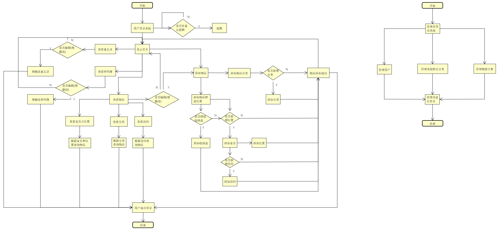
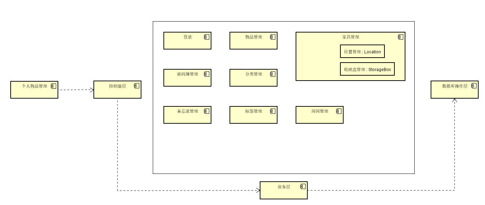

# 概要设计说明书

## 1 引言

### 1.1 编写目的

该说明书是为了说明“个人物品管理”的整体系统架构，及需求用例的各个功能在架构中的体现，根据需求说明书的要求，对本开发项目进行初步的总体概要设计，根据功能对系统进行功能划分，建立模块层次结构和调用关系，确定模块接口和人机交互界面等；同时确定系统技术栈，确定数据结构特征，和数据库设计，为系统详细设计人员进行说明。
预期读者：程序开发人员。

### 1.2 背景

1. 待开发软件系统的名称：个人物品管理系统(My Own Items)
2. 项目的任务提出者：Kay
3. 开发者：Kay
4. 用户：Kay 及未来更多用户
5. 将运行该软件的计算站：暂定云服务器部署，Web和手机端使用。

### 1.3 定义

- My Own Items：系统暂用名，项目名。
- Kay：项目负责人及实施人，即作者。

### 1.4 参考资料

1. 概要设计说明书（GB8567——88）
2. 本项目的软件需求说明书
3. 本项目的数据库设计说明书

## 2 总体设计

### 2.1 需求规定

本系统的主要的输入输出项目、处理的功能性能要求，与需求文档中的保持一致。
| 模块名称 | 功能描述 | 输入 | 处理 | 输出 | 上级模块 | 下级调用模块 |
|---|---|---|---|---|---|---|
| 用户登录  | 用户登录系统  | 用户名,密码  | 验证用户名密码  | 登录成功/失败报告  | 无 | 无 |
|  添加物品 | 用户添加个人物品  | 物品信息  | 根据物品信息添加相应位置,分类等  | 添加结果  | 无 | 无,或添加房间,家具,位置,收纳盒,分类,标签等 |
| 添加房间  | 添加房间  | 房间信息  | 保存房间信息  | 添加结果  | 无,或添加物品模块  | 无,或添加家具  |
| 添加家具   | 添加房间的家具  | 家具信息  | 保存家具信息  | 添加结果  |  无,或添加房间 | 无,或添加位置  |
| 添加位置   | 添加家具的布局,作为物品摆放位置  |  家具布局信息 |  保存位置信息 | 添加结果  |  无,或添加家具 |  无 |
| 添加收纳盒   | 添加家具中摆放的收纳盒  |  收纳盒信息 | 保存收纳盒信息  | 添加结果  |  无,或添加物品 | 无  |
| 添加分类/子分类   |  添加物品的分类 |  分类信息和icon | 保存分类和子分类  | 添加结果  | 无  | 无  |
| 查询物品   | 根据条件查询物品  | 查询条件,位置,分类,标签等  | 根据条件查询物品  | 物品信息  | 获取查询条件  | 无  |
| 添加账号记录  |  在密码簿中添加账号密码备忘 | 账号密码  | 保存账号密码  | 添加结果  | 无  | 无  |
| 添加备忘   | 在备忘录中添加备忘  | 备忘信息,提醒时间  | 保存备忘,添加提醒任务  | 添加结果,定时提醒  | 无  | 无  |
| 管理员管理用户   | 管理员对系统用户进行管理  | 指定用户,管理指令  | 根据管理指令进行相应操作,如冻结,解冻,删除,重置密码等  | 管理结果  | 无  | 无  |
| 管理员管理系统默认分类   | 管理系统中默认显示的分类  | 分类信息  | 保存分类信息  | 当前分类信息  | 查询当前分类信息  | 无  |
| 管理员管理系统ICON   | 对系统中的各种分类icon进行管理  | 新增/修改/删除icon,及icon的分类  | 保存icon操作到指定分类  | 当前系统icon  | 查询当前icon信息  | 无  |

### 2.2 运行环境

系统部署环境为云服务器，基本配置为处理器2核及以上，4G内存及以上，硬盘存储空间10G以上，待项目完成开发后根据实际情况选择合适的服务器租用。

### 2.3 基本设计概念和处理流程

系统流程图

### 2.4 结构
模块结构图

### 2.5 功能需求求与程序的关系

本条用一张如下的矩阵图说明各项功能需求的实现同各块程序的分配关系：

|           | 物品管理模块 | 家具管理模块 | 分类管理模块 | 标签管理模块 | 房间管理模块 | 密码簿管理模块 | 备忘录管理模块 | 用户管理模块 |
| --------- | ----- | ----- | ---- | ----- |----- |----- |----- |----- |
| 用户登录  | | | | | | | |√ |
|  添加物品 | √|√ | √| √|√ | | | |
| 添加房间  | | | | | √| | | |
| 添加家具   | |√ | | | | | | |
| 添加位置   | |√ | | | | | | |
| 添加收纳盒   | | √| | | | | | |
| 添加分类/子分类   | | |√ | | | | | |
| 查询物品   |√ |√ | √| √|√ | | | |
| 添加账号记录  | | | | | |√ |  | |
| 添加备忘   | | | | | | |√ | |
| 管理员管理用户   | | | | | | | | √|
| 管理员管理系统默认分类   | | |√ | | | | | |
| 管理员管理系统ICON   | | | √| | | | | |

### 2.6 人工处理过程

软件系统的业务流程无须人工处理，部分输入输出约束可能需要前端与后端同时控制，不可完全依赖后端校验。

### 2.7 尚未解决的问题

1. 目前各具体功能的输入输出仍需进一步确认
2. 密码簿加密方式待确认
3. 服务器硬件配置待确认

## 3 接口设计

### 3.1 用户接口

提供给用户的接口均为RESTful风格的WebAPI接口，通过前端图形化页面进行调用与访问；参数格式与响应信息以Json为主。

### 3.2 外部接口

本系统可能存在需要使用第三方接口情况，同样为WebAPI开放接口，在业务层实现调用，无需用户自行请求。
软硬件接口暂无自定义接口。

### 3.3 内部接口

本系统后端为经典三层架构，控制层与业务层使用Service接口调用，业务层与数据层通过DAO接口调用。
前端使用WebAPI接口调用控制层。

## 4 运行设计

### 4.1 运行模块组合

本系统依据实体划分功能模块，各模块实现各自实体的相关操作不影响其他模块。各模块间根据逻辑关系进行相互调用，从而实现完整的业务流程。  
| 模块名称 | 模块功能 | 关联模块 | 备注 |
| --- | --- | --- | --- |
| 用户模块  | 用户信息管理，登录管理，绑定系统功能等  |   | |
| 物品模块  | 物品信息的管理与查看，与位置、分类、标签等模块进行关联  | 位置模块，标签模块，分类模块等  | |
| 位置模块  | 与家具模块和收纳盒模块一起实现物品摆放位置的功能，与物品模块关联，用于说明物品的位置信息  | 家具模块，收纳盒模块，物品模块 |  位置实际上是一个有些抽象的概念，实际上是家具的分隔  |
| 家具模块  | 作为位置的父模块，位置模块依附于家具模块，同时家具模块也实现对家具的管理  | 位置模块，房间模块  |  |
| 收纳盒模块  | 作为位置的子模块，作为物品位置的一个辅助模块，是可选的，便于对物品摆放的收纳盒进行管理，而不单单只关联位置  | 位置模块，物品模块  |   |
| 房间模块  | 对房间进行管理，与家具模块，代表家具所属房间  | 家具模块  |   |
| 分类模块  | 将物品分类单独作为一个模块进行管理，包含父级子级分类的管理，和分类图标的管理  | 物品模块  |   |
| 标签模块  | 将物品标签单独作为一个模块进行管理，方便管理与查询  | 物品模块  |   |
| 密码簿模块  | 管理用户的密码簿  | 用户模块  |   |
| 备忘录模块  | 管理用户备忘录  | 用户模块  |   |

### 4.2 运行控制

说明每一种外界的运行控制的方式方法和操作步骤。
| 运行控制 | 操作步骤 | 调用模块 | 备注说明 |
| --- | --- | --- | --- |
| 用户登录  | 用户提交用户名和密码请求登录系统，系统对用户名密码进行校验，并返回校验结果  | 用户模块  |   |
| 物品管理  | 用户对物品进行管理，包括新增、修改、删除，可对物品的位置、分类、标签、物品信息等进行修改  | 物品模块 分类模块 位置模块 标签模块  | 该操作不可直接对其他模块内容进行修改，如需修改，将跳转进行其他模块的控制操作  |
| 物品查看  | 用户根据位置、房间、分类、标签及其他筛选条件对物品进行查看，通过切换筛选方式使用不同方式进行查询  | 物品模块 位置模块 分类模块 标签模块  |   |
| 位置管理  | 在家具视图中，对物品摆放位置进行管理，即查看和管理家具的布局，可以自由组合修改  | 家具模块 位置模块  | 需要注意的是对于已存放物品的位置的处理，确保数据的正确性  |
| 收纳盒管理  | 在位置管理视图中，可对存放在位置中的收纳盒及收纳盒中的物品进行管理和查看  | 位置模块 收纳盒模块 物品模块  |   |
| 家具管理  | 在家具视图中，可根据房间查看家具，可对家具进行管理操作，如移动，修改信息，修改布局等  | 家具模块 房间模块  |   |
| 房间管理  | 对房间进行管理，新增房间，修改房间信息，删除房间，查看房间家具等操作  | 房间模块 家具模块  |   |
| 分类管理  | 对分类进行管理，修改分类的名称，图标，父级子级等  | 分类模块  |   |
| 标签管理  | 管理标签，查看标签物品，增删改标签  | 标签模块  |   |
| 密码簿管理  | 在密码簿视图中，查看和管理个人密码簿，密码默认隐藏，点击才可显示  | 密码簿模块  |   |
| 备忘录管理  | 在备忘录视图中，查看和管理备忘录，根据备忘录提醒时间进行提醒  | 备忘录模块  |   |
| 临期提醒  | 在系统首页显示临期提醒，用户可设置临期提醒期限，对符合期限的物品在首页  |   |   |

### 4.3 运行时间

该系统中，位置模块的操作相对复杂，可能需要较多处理时间，但不可对用户体验产生较大影响；其他模块功能需符合一般Web应用的运行时间规定。

## 5 系统数据结构设计

### 5.1 逻辑结构设计要点
系统E-R图如下，详细内容说明见数据库设计说明书。

### 5.2 物理结构设计要点

本系统的数据表清单如下，各表的详细信息见数据库设计说明书。
| 名称             | 代码                              |
| ---------------- | --------------------------------- |
| 备忘录           | item_memorandum                   |
| 家具             | item_furniture                    |
| 密码簿           | item_password_book                |
| 房间             | item_room                         |
| 收纳盒           | item_storage_box                  |
| 数据字典         | sys_dictionary                    |
| 物品             | item_item                         |
| 物品位置         | item_location                     |
| 物品分类         | item_classification               |
| 物品分类关联     | item_item_classification_relation |
| 物品标签         | item_label                        |
| 物品标签关联     | item_item_label_relation          |
| 用户             | sys_user                          |
| 系统默认物品分类 | sys_default_classification        |

### 5.3 数据结构与程序的关系

各数据结构以数据表形式进行访问，统一使用MySQL数据层方式进行映射和操作。

## 6 系统出错处理设计

### 6.1 出错信息

用一览表的方式说朗每种可能的出错或故障情况出现时，系统输出信息的形式、含意及处理方法。
| 出错信息 | 输出信息 | 含义方法 | 处理方法 |
| --- | --- | --- | --- |
| DataException  | 数据库读取错误  | 数据层的异常，可能包含插入、修改、删除错误等 | 开发人员调试解决  |
| ParamException  | 请求参数错误  | 后端接收请求的参数不符合接口要求  | 检查参数格式等再次请求  |
| BusinessException  | 业务逻辑异常  | 通常为业务处理过程中发生的异常  | 开发人员调试解决  |
| TimeOutException  | 请求超时  | 后端请求超时  | 若为网络原因等待网络恢复即可；若为系统逻辑问题则开发人员进行修复  |
| PermissionException  | 权限错误  | 用户无执行该操作的权限  | 显示提示信息  |
| VerifyException  | 校验错误  | 通常为登录校验、权限校验等错误  | 显示提示信息  |
| SystemException  | 系统异常  | 内存溢出、数据库连接异常、请求地址异常等  | 运维人员解决  |

### 6.2 补救措施
1. 对于系统错误、数据库异常、业务异常等，由开发和测试人员进行调试记录，找到异常愿意并解决，同时及时发布修改版本。
2. 对于网络异常、硬件异常等，由运维人员进行排查解决。
3. 对于参数异常等用户操作引发的异常，需将异常情况考虑清晰，在用户手册中进行写明，便于用户进行查阅，进而执行符合规范的操作。
4. 对于不可抗力引发的系统异常，如服务器宕机，网络异常等问题，系统维护人员需能提供有效的数据备份措施，确保尽可能少的发生数据丢失问题。

### 6.3 系统维护设计

1. 定期备份数据库，备份文件以`[database]-[date]`格式进行命名
2. 定期检查数据库一致性
3. 定期查看系统操作日志，排查异常操作
4. 定期清理冗余、过期数据
