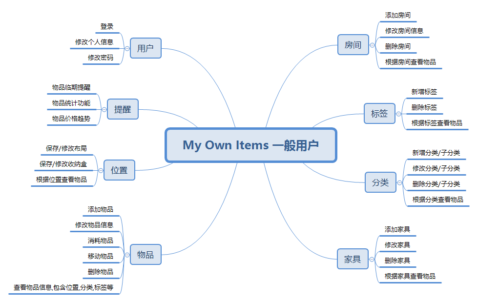
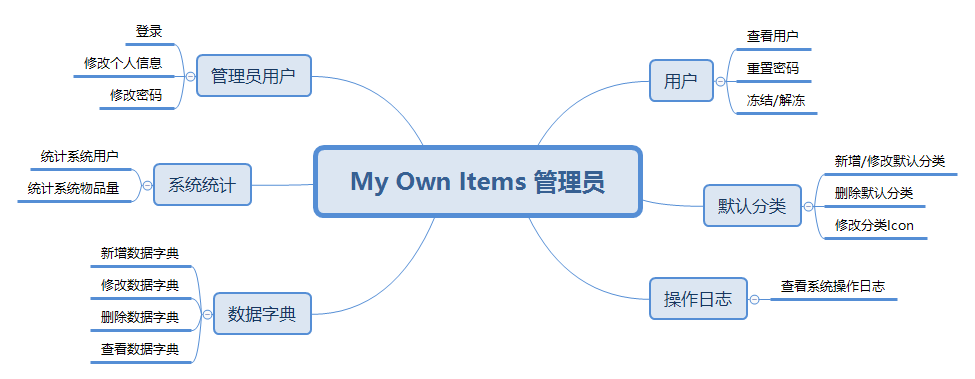

# 详细设计说明书

## 1引言

### 1.1编写目的

本详细设计说明书为`My Own Items`项目开发的详细设计，编写目的是在概要设计说明书基础上进一步明确系统结构，制定开发规范，为系统开发做准备，并以明确文本形式进行记录和保存。
预期读者为本系统的开发人员，测试人员和维护人员，即笔者。

### 1.2背景

1. 待开发软件系统的名称：个人物品管理系统(My Own Items)
2. 项目的任务提出者：Kay
3. 开发者：Kay
4. 用户：Kay 及未来更多用户
5. 将运行该软件的计算站：暂定云服务器部署，Web和手机端使用。

### 1.3定义

- My Own Items：系统暂用名，项目名。
- Kay：项目负责人及实施人，即作者。

### 1.4参考资料

1. 详细设计说明书（GB8567——88）
2. 本项目的软件需求说明书 https://github.com/kimikudo/my-own-items-back/blob/master/documents/%E8%BD%AF%E4%BB%B6%E9%9C%80%E6%B1%82%E8%AF%B4%E6%98%8E%E4%B9%A6.md
3. 本项目的数据库设计说明书 https://github.com/kimikudo/my-own-items-back/blob/master/documents/%E6%95%B0%E6%8D%AE%E5%BA%93%E8%AE%BE%E8%AE%A1%E8%AF%B4%E6%98%8E%E4%B9%A6.md
4. 本项目的概要设计说明书 https://github.com/kimikudo/my-own-items-back/blob/master/documents/%E6%A6%82%E8%A6%81%E8%AE%BE%E8%AE%A1%E8%AF%B4%E6%98%8E%E4%B9%A6.md

## 2程序系统的结构

用一系列图表列出本程序系统内的每个程序（包括每个模块和子程序）的名称、标识符和它们之间 的层次结构关系。
- 一般用户功能模块

- 管理员功能模块

## 3程序1（标识符）设计说明

从本章开始，逐个地给出各个层次中的每个程序的设计考虑。以下给出的提纲是针对一般情况的。对于一个具体的模块，尤其是层次比较低的模块或子程序，其很多条目的内容往往与它所隶属的上一层 模块的对应条目的内容相同，在这种情况下，只要简单地说明这一点即可。

### 3.1程序描述

给出对该程序的简要描述，主要说明安排设计本程序的目的意义，并且，还要说明本程序的特点（如 是常驻内存还是非常驻？是否子程序？是可重人的还是不可重人的？有无覆盖要求？是顺序处理还是并发处理等）。

### 3.2功能

说明该程序应具有的功能，可采用IPO图（即输入一处理一输出图）的形式。

### 3.3性能

说明对该程序的全部性能要求，包括对精度、灵活性和时间特性的要求。

### 3.4输入项

给出对每一个输入项的特性，包括名称、标识、数据的类型和格式、数据值的有效范围、输入的方式。数量和频度、输入媒体、输入数据的来源和安全保密条件等等。

### 3.5输出项

给出对每一个输出项的特性，包括名称、标识、数据的类型和格式，数据值的有效范围，输出的形式、数量和频度，输出媒体、对输出图形及符号的说明、安全保密条件等等。

### 3.6算法

详细说明本程序所选用的算法，具体的计算公式和计算步骤。

### 3.7流程逻辑

用图表（例如流程图、判定表等）辅以必要的说明来表示本程序的逻辑流程。

### 3.8接口

用图的形式说明本程序所隶属的上一层模块及隶属于本程序的下一层模块、子程序，说明参数赋值和调用方式，说明与本程序相直接关联的数据结构（数据库、数据文卷）。

### 3.9存储分配

根据需要，说明本程序的存储分配。

### 3.10注释设计

说明准备在本程序中安排的注释，如：

a． 加在模块首部的注释；

b． 加在各分枝点处的注释；

c． 对各变量的功能、范围、缺省条件等所加的注释；

d． 对使用的逻辑所加的注释等等。

### 3.11限制条件

说明本程序运行中所受到的限制条件。

### 3.12测试计划

说明对本程序进行单体测试的计划，包括对测试的技术要求、输入数据、预期结果、进度安排、人员职责、设备条件驱动程序及桩模块等的规定。

### 3.13尚未解决的问题

说明在本程序的设计中尚未解决而设计者认为在软件完成之前应解决的问题。

## 4程序2（标识符）设计说明

用类似F．3的方式，说明第2个程序乃至第N个程序的设计考虑。

......
