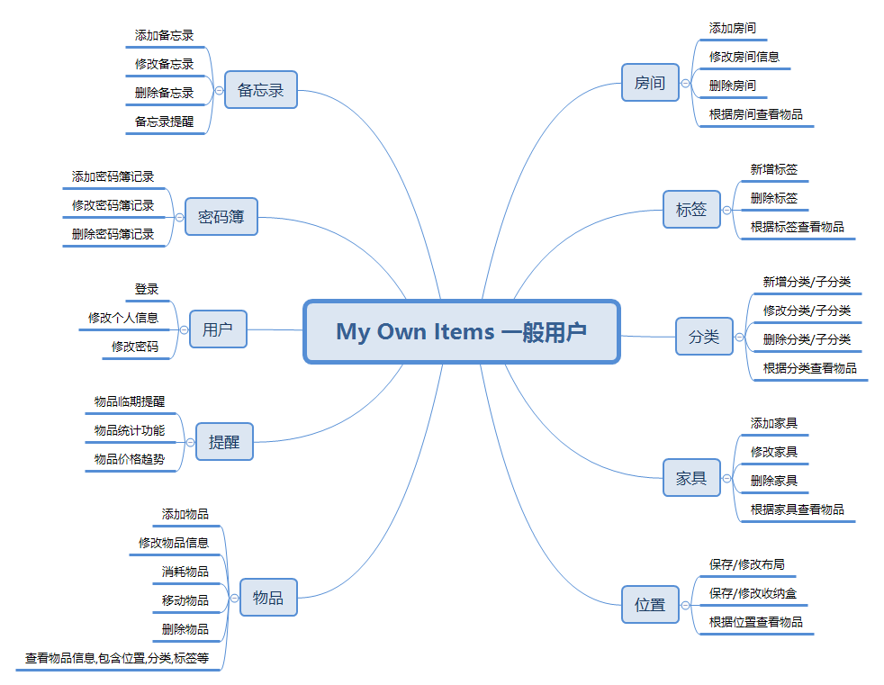

# 详细设计说明书

[TOC]

## 1 引言

### 1.1 编写目的

本详细设计说明书为`My Own Items`项目开发的详细设计，编写目的是在概要设计说明书基础上进一步明确系统结构，制定开发规范，为系统开发做准备，并以明确文本形式进行记录和保存。
预期读者为本系统的开发人员，测试人员和维护人员，即笔者。

### 1.2 背景

1. 待开发软件系统的名称：个人物品管理系统(My Own Items)
2. 项目的任务提出者：Kay
3. 开发者：Kay
4. 用户：Kay 及未来更多用户
5. 将运行该软件的计算站：暂定云服务器部署，Web和手机端使用。

### 1.3 定义

- My Own Items：系统暂用名，项目名。
- Kay：项目负责人及实施人，即作者。

### 1.4 参考资料

1. 详细设计说明书（GB8567——88）
2. 本项目的软件需求说明书 https://github.com/kimikudo/my-own-items-back/blob/master/documents/%E8%BD%AF%E4%BB%B6%E9%9C%80%E6%B1%82%E8%AF%B4%E6%98%8E%E4%B9%A6.md
3. 本项目的数据库设计说明书 https://github.com/kimikudo/my-own-items-back/blob/master/documents/%E6%95%B0%E6%8D%AE%E5%BA%93%E8%AE%BE%E8%AE%A1%E8%AF%B4%E6%98%8E%E4%B9%A6.md
4. 本项目的概要设计说明书 https://github.com/kimikudo/my-own-items-back/blob/master/documents/%E6%A6%82%E8%A6%81%E8%AE%BE%E8%AE%A1%E8%AF%B4%E6%98%8E%E4%B9%A6.md

## 2 程序系统的结构

用一系列图表列出本程序系统内的每个程序（包括每个模块和子程序）的名称、标识符和它们之间 的层次结构关系。
- 一般用户功能模块

- 管理员功能模块

## 3 用户模块设计说明

### 3.1 程序描述

该模块为用户管理模块，包括用户的登录、管理、权限等，总体分为普通用户和管理员用户，使用角色-权限框架对不同用户进行管理，获取各自权限进行权限控制。需要注意的是这部分对权限资源需要根据具体功能接口进行分配。

### 3.2 功能

功能说明IPO表
| 功能描述 | 输入 | 处理 | 输出 |
| --- | --- | --- | --- |
| 用户登录  | 用户名，密码  | 用户验证  | 用户验证结果及用户角色、权限  |
| 新增用户（管理员新增，用户注册） | 用户信息  | 保存用户信息  | 保存结果  |
| 查询用户  | 查询条件  | 根据条件查询用户列表  | 查询结果  |
| 修改密码（管理员重置密码，用户修改密码）  | 旧、新密码  | 验证旧密码，修改新密码  | 修改结果  |
| 修改个人信息  | 个人信息  | 保存修改过的个人信息  | 修改结果  |
| 微信登录  | 微信登录输入  | 通过微信一键登录  | 登录结果  |
| 冻结、解冻用户  | 用户ID  | 修改用户冻结状态  | 冻结结果  |
| 删除用户  | 用户ID  | 删除用户  | 删除结果  |

### 3.3 性能

精度：确保传输的数据精度不发生丢失的情况，用户信息加密传输
灵活性：用户角色权限部分可拓展，对于后续可能出现的多种角色要做到可扩展。
时间特性：响应时间符合基本要求，接口响应时间<2s。

### 3.4 输入项

给出对每一个输入项的特性，包括名称、标识、数据的类型和格式、数据值的有效范围、输入的方式。数量和频度、输入媒体、输入数据的来源和安全保密条件等等。
| 名称 | 标识 | 数据类型 | 数据格式 | 数据值有效范围 | 输入方式 | 输入数量 | 输入媒体 | 输入数据来源 | 安全保密条件 |
| --- | --- | --- | --- | --- | --- | --- | --- | --- | --- |
| 用户名  | username  | String  | 任意字符串  | 8-20位字符长度 | 手动输入  | 单一  | 表单输入  | 用户自行输入  | 系统内不可重复  |
| 密码  | password  | String  | 任意字符串  | 6-20位字符长度  | 手动输入  | 单一  | 表单输入  | 用户自行输入  | 注册和修改时需输入两次且保持一致 |
| 用户昵称  | name  | String  | 任意字符串  | 1-20位字符长度  | 手动输入  | 单一  | 表单输入  | 用户自行输入  | 任意  |
| 手机号  | phoneNumber  | String  | 符合手机号正则表达式  | 11位数字  | 手动输入或微信获取  | 单一  | 表单输入  | 用户自行输入或微信获取  | 加密传输，显示时隐藏中间4位  |
| 用户状态  | state | int  | 数字  | 0或1  | 选择  | 单一  | 下拉框  | 开发约定  | 任意  |

### 3.5 输出项

与输入项一致。

### 3.6 算法

无特殊算法，基于基本应用逻辑。

### 3.7 流程逻辑

### 3.8 接口

本模块使用Shiro权限框架，提供用户的权限验证功能，并将权限以资源形式向其他模块开放，其他模块可使用本模块的数据进行权限控制。

### 3.9 存储分配

见数据库设计说明书中的数据表各字段长度设计。

### 3.10 注释设计

无特定注释要求，注释符合阿里编码规范的注释即可。

### 3.11 限制条件

使用权限框架开发可能会受限于框架，但目前需求框架均能满足。

### 3.12 测试计划

这里仅对测试计划进行说明，具体测试输入、预期结果、人员安排等将在测试计划书中进行详细说明。
| 测试名称 | 测试要求 | 进度安排 |
| --- | --- | --- |
| 基本功能测试  | 参照用户模块的功能列表测试该模块的基本功能  | 开发完成后  |
| 非法数据输入测试  | 测试表单输入非法格式数据时系统处理情况  | 基本功能测试完成后 |
| 权限控制测试  | 测试其他模块接口的权限控制可否实现 | 其他模块开发完成后  |

### 3.13 尚未解决的问题

目前系统用户分类较为简单，不必采用角色-权限控制，但需保留可拓展性，后续如需实现此部分功能，尽可能避免大量修改。

## 4 物品管理模块设计说明

### 4.1 程序描述

该模块为本系统的核心模块及核心功能，本模块与其他模块均有关联，其他模块的功能也是基于本模块进行的。由于与多个模块存在关联，所以该模块的功能相对较为繁琐，
给出对该程序的简要描述，主要说明安排设计本程序的目的意义，并且，还要说明本程序的特点（如 是常驻内存还是非常驻？是否子程序？是可重人的还是不可重人的？有无覆盖要求？是顺序处理还是并发处理等）。

### 4.2 功能

说明该程序应具有的功能，可采用IPO图（即输入一处理一输出图）的形式。

### 4.3 性能

说明对该程序的全部性能要求，包括对精度、灵活性和时间特性的要求。

### 4.4 输入项

给出对每一个输入项的特性，包括名称、标识、数据的类型和格式、数据值的有效范围、输入的方式。数量和频度、输入媒体、输入数据的来源和安全保密条件等等。

### 4.5 输出项

给出对每一个输出项的特性，包括名称、标识、数据的类型和格式，数据值的有效范围，输出的形式、数量和频度，输出媒体、对输出图形及符号的说明、安全保密条件等等。

### 4.6 算法

详细说明本程序所选用的算法，具体的计算公式和计算步骤。

### 4.7 流程逻辑

用图表（例如流程图、判定表等）辅以必要的说明来表示本程序的逻辑流程。

### 4.8 接口

用图的形式说明本程序所隶属的上一层模块及隶属于本程序的下一层模块、子程序，说明参数赋值和调用方式，说明与本程序相直接关联的数据结构（数据库、数据文卷）。

### 4.9 存储分配

根据需要，说明本程序的存储分配。

### 4.10 注释设计

说明准备在本程序中安排的注释，如：

a． 加在模块首部的注释；

b． 加在各分枝点处的注释；

c． 对各变量的功能、范围、缺省条件等所加的注释；

d． 对使用的逻辑所加的注释等等。

### 4.11 限制条件

说明本程序运行中所受到的限制条件。

### 4.12 测试计划

说明对本程序进行单体测试的计划，包括对测试的技术要求、输入数据、预期结果、进度安排、人员职责、设备条件驱动程序及桩模块等的规定。

### 4.13 尚未解决的问题

说明在本程序的设计中尚未解决而设计者认为在软件完成之前应解决的问题。

## 5 家具管理模块设计说明

## 6 位置管理模块设计说明

## 7 房间管理模块设计说明

## 8 分类管理模块设计说明

## 9 标签管理模块设计说明

## 10 密码簿管理模块设计说明

## 11 备忘录管理模块设计说明

## 12 统计模块（前后台首页展示）设计说明

## 13 数据字典管理模块设计说明

## 14 操作日志管理模块设计说明

用类似F．3的方式，说明第2个程序乃至第N个程序的设计考虑。
从本章开始，逐个地给出各个层次中的每个程序的设计考虑。以下给出的提纲是针对一般情况的。对于一个具体的模块，尤其是层次比较低的模块或子程序，其很多条目的内容往往与它所隶属的上一层 模块的对应条目的内容相同，在这种情况下，只要简单地说明这一点即可。
### 3.1程序描述

给出对该程序的简要描述，主要说明安排设计本程序的目的意义，并且，还要说明本程序的特点（如 是常驻内存还是非常驻？是否子程序？是可重人的还是不可重人的？有无覆盖要求？是顺序处理还是并发处理等）。

### 3.2功能

说明该程序应具有的功能，可采用IPO图（即输入一处理一输出图）的形式。

### 3.3性能

说明对该程序的全部性能要求，包括对精度、灵活性和时间特性的要求。

### 3.4输入项

给出对每一个输入项的特性，包括名称、标识、数据的类型和格式、数据值的有效范围、输入的方式。数量和频度、输入媒体、输入数据的来源和安全保密条件等等。

### 3.5输出项

给出对每一个输出项的特性，包括名称、标识、数据的类型和格式，数据值的有效范围，输出的形式、数量和频度，输出媒体、对输出图形及符号的说明、安全保密条件等等。

### 3.6算法

详细说明本程序所选用的算法，具体的计算公式和计算步骤。

### 3.7流程逻辑

用图表（例如流程图、判定表等）辅以必要的说明来表示本程序的逻辑流程。

### 3.8接口

用图的形式说明本程序所隶属的上一层模块及隶属于本程序的下一层模块、子程序，说明参数赋值和调用方式，说明与本程序相直接关联的数据结构（数据库、数据文卷）。

### 3.9存储分配

根据需要，说明本程序的存储分配。

### 3.10注释设计

说明准备在本程序中安排的注释，如：

a． 加在模块首部的注释；

b． 加在各分枝点处的注释；

c． 对各变量的功能、范围、缺省条件等所加的注释；

d． 对使用的逻辑所加的注释等等。

### 3.11限制条件

说明本程序运行中所受到的限制条件。

### 3.12测试计划

说明对本程序进行单体测试的计划，包括对测试的技术要求、输入数据、预期结果、进度安排、人员职责、设备条件驱动程序及桩模块等的规定。

### 3.13尚未解决的问题

说明在本程序的设计中尚未解决而设计者认为在软件完成之前应解决的问题。
