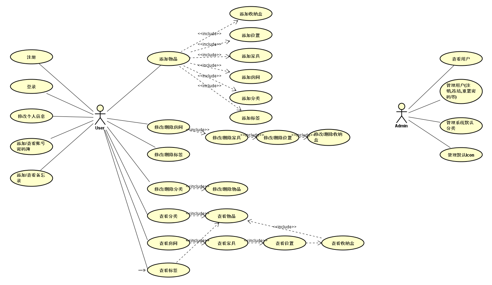
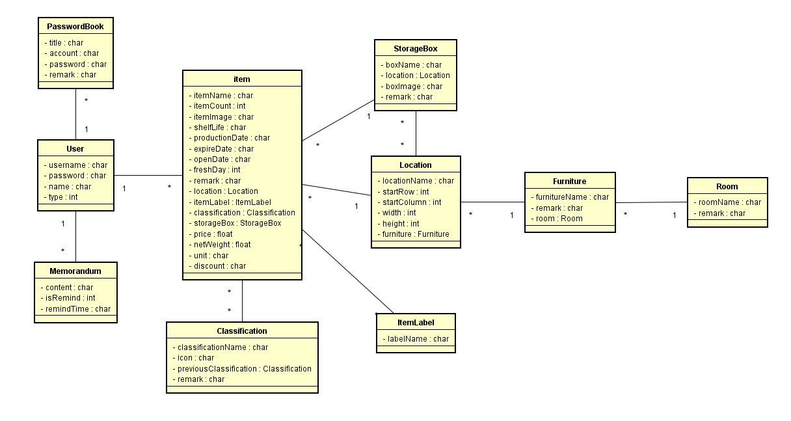
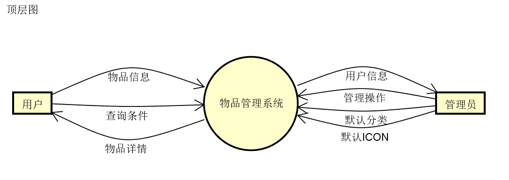
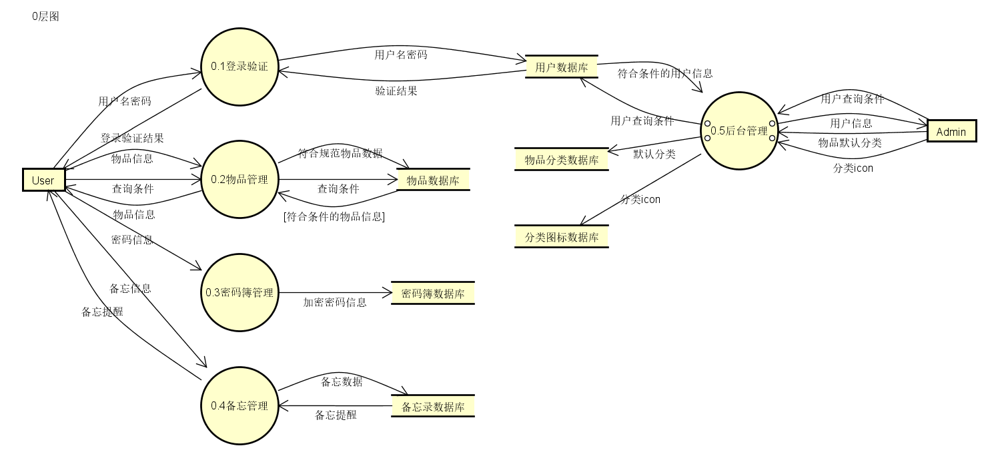
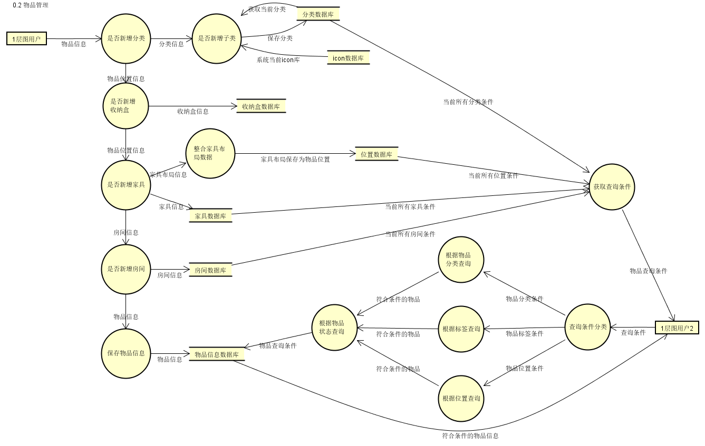

# 软件需求说明书
[TOC]

## 1 引言

### 1.1 编写目的
本需求说明书为“个人物品管理”（暂定名）的需求分析，作为项目开发前期的需求确定和初步设计，阅读人员仅限开发人员（即笔者自己）。
### 1.2 背景
该软件暂定名称为“个人物品管理”,英文名"My Own Items"，为一个个人家庭物品管理的软件，项目的任务提出者、开发者、用户目前均只有笔者自己，初步规划为web项目，后期或许会进行手机端的开发。项目完成之后，会选择部署私人服务器供个人使用，如他人有兴趣也可能会提供给他人使用。软件开发过程中，代码会提交至开发者的GitHub仓库，且仓库公开,即该项目为全开源项目。
### 1.3 定义

项目英文名：My Own Items
其他在用到时进行补充。

### 1.4 参考资料
- 微信小程序“家里有什么”
- 软件需求说明书（GB856T——88）
## 2 任务概述
### 2.1 目标
- 开发意图：该软件旨在开发一款可以方便用户管理和记录个人物品的软件，对个人物品的拥有数量、摆放位置、过期时间等进行记录和提醒；同时兼具密码簿、备忘录等便利功能。应用目标即为作为一款多端共享的物品管理软件。
- 应用目标：能实现预期功能，便于用户使用，多端数据共享。
- 作用范围：Web端和手机端均可使用，任意用户均可使用。
- 背景材料：开发本软件的初衷是看到“家里有什么”的微信小程序之后，对其功能比较满意，认为其设计思想对于用户来说较为方便，十分适合物品众多且杂乱的人群或养宠物人群使用，但对笔者个人来说，又缺乏一些其他功能。所以打算在其基础上开发一款自己的软件，用作个人使用，如果可以也会推广给其他人使用。
### 2.2 用户的特点
该软件没有使用门槛，任何用户均可使用。但使用本软件的用户多为个人物品较多较杂乱人群，为方便这类用户，本软件提供直观的分类方式和简便的记录操作，便于用户对物品进行归类和记录。同时提供过期提醒等功能，及时提醒到期物品，便于用户及时处理。
### 2.3 假定和约束
由于项目没有明确的上线日期，所以项目周期暂无规定。由于仅有笔者一人完成所有开发任务，且只能利用无工作任务的时间或业余时间，所以可能无法准确按照项目计划完成开发任务，项目周期可能会随时进行修改。
项目资金目前仅开发完成之后的云服务器，由笔者承担。后续若需要付费API，付费软件或付费服务等，再作记录。
## 3 需求规定
### 3.1 对功能的规定
1. 用列表的方式（例如IPO表即输入、处理、输出表的形式），逐项定量和定性地叙述对软件所提出的功能要求，说明输入什么量、经怎样的处理、得到什么输出，说明软件应支持的终端数和应支持的并行操作的用户数。
#### 系统用例图

#### 系统类图

#### 数据流图(DFD)
其实我DFD不太会画,IPO表也没写过,只能画个大概了.

#### IPO表
| 模块名称 | 功能描述 | 输入 | 处理 | 输出 | 上级模块 | 下级调用模块 |
|---|---|---|---|---|---|---|
| 用户登录  | 用户登录系统  | 用户名,密码  | 验证用户名密码  | 登录成功/失败报告  | 无 | 无 |
|  添加物品 | 用户添加个人物品  | 物品信息  | 根据物品信息添加相应位置,分类等  | 添加结果  | 无 | 无,或添加房间,家具,位置,收纳盒,分类,标签等 |
| 添加房间  | 添加房间  | 房间信息  | 保存房间信息  | 添加结果  | 无,或添加物品模块  | 无,或添加家具  |
| 添加家具   | 添加房间的家具  | 家具信息  | 保存家具信息  | 添加结果  |  无,或添加房间 | 无,或添加位置  |
| 添加位置   | 添加家具的布局,作为物品摆放位置  |  家具布局信息 |  保存位置信息 | 添加结果  |  无,或添加家具 |  无 |
| 添加收纳盒   | 添加家具中摆放的收纳盒  |  收纳盒信息 | 保存收纳盒信息  | 添加结果  |  无,或添加物品 | 无  |
| 添加分类/子分类   |  添加物品的分类 |  分类信息和icon | 保存分类和子分类  | 添加结果  | 无  | 无  |
| 查询物品   | 根据条件查询物品  | 查询条件,位置,分类,标签等  | 根据条件查询物品  | 物品信息  | 获取查询条件  | 无  |
| 添加账号记录  |  在密码簿中添加账号密码备忘 | 账号密码  | 保存账号密码  | 添加结果  | 无  | 无  |
| 添加备忘   | 在备忘录中添加备忘  | 备忘信息,提醒时间  | 保存备忘,添加提醒任务  | 添加结果,定时提醒  | 无  | 无  |
| 管理员管理用户   | 管理员对系统用户进行管理  | 指定用户,管理指令  | 根据管理指令进行相应操作,如冻结,解冻,删除,重置密码等  | 管理结果  | 无  | 无  |
| 管理员管理系统默认分类   | 管理系统中默认显示的分类  | 分类信息  | 保存分类信息  | 当前分类信息  | 查询当前分类信息  | 无  |
| 管理员管理系统ICON   | 对系统中的各种分类icon进行管理  | 新增/修改/删除icon,及icon的分类  | 保存icon操作到指定分类  | 当前系统icon  | 查询当前icon信息  | 无  |
### 3.2 对性能的规定
#### 3.2.1 精度
对于部分特定格式的数据（如日期时间等）需符合指定格式，且对不符合格式要求的数据进行提示。
#### 3.2.2 时间特性要求
1. 响应时间：<2s；
2. 更新处理时间：<3s；
3. 数据的转换和传送时间：<2s；
4. 解题时间：<5s。
#### 3.2.3 灵活性
说明对该软件的灵活性的要求，即当需求发生某些变化时，该软件对这些变化的适应能力，如：
1. 操作方式上的变化：软件需能适应PC网页、手机、平板等多设备终端的操作方式；
2. 运行环境的变化：本软件后端使用Java进行开发，需能确保多平台的兼容；前端使用React，需能确保多浏览器（IE除外）的兼容；
3. 同其他软件的接口的变化：由于手机端和Web共用同一后端，所以后端接口的请求格式与相应格式需能同时适应多种设备终端，确保前端与后端对接的要求；
4. 精度和有效时限的变化：数据库设计要求确保当数据精度发生变化时不发生异常；
5. 计划的变化或改进：软件设计阶段需充分考虑设计的可拓展性，确保当需求发生改变或增加时，能够较为便捷地进行修改和新增，且不影响现有功能。
### 3.3 输入输出要求
1. 本软件的输入、输出以String为主；
2. 对于数值型的输入输出，整型即为int，浮点型精确到小数点后2位；
3. 对于日期时间的输入输出数据，以`yyyy-MM-dd HH:mm:ss`格式进行输入输出；
4. 对于密码等数据，以加密形式进行传输；
5. 对于后端接口，正常响应码为200，异常响应码为999，且同时返回异常信息；前端异常信息需配置异常页面。
### 3.4 数据管理能力要求
本软件啊使用数据库对数据进行存储与读取，单用户数据量预估最多在万级，数据库压力较轻。数据库表设计时需充分考虑拓展性，对于字段增加和修改需能确保数据缺省不发生异常，或数据能够及时更新和补充。
对于系统中涉及文件的操作，需求长期存储的文件应确保服务器有足够的空间进行存储，对于临时文件需定时进行清理释放服务器空间资源。
### 3.5 故障处理要求
对于软件依赖文件确实或资源缺失问题，系统应进行提示；
对于软件异常需在软件开发过程中进行预估和处理，确保不发生软件引起的宕机问题，如内存溢出等问题；
对于硬件故障引发的系统问题，需确保数据不发生丢失。
### 3.6 其他专门要求
开发人员应定期对软件数据、运行环境等进行维护，及时解决系统漏洞并及时发布最新版本。
## 4 运行环境规定
### 4.1 设备
待定，至少1核，2G内存服务器即可，后续根据计算需求进行提升。
1. 处理器型号及内存容量；
2. 外存容量、联机或脱机、媒体及其存储格式，设备的型号及数量；
3. 输入及输出设备的型号和数量，联机或脱机；
4. 数据通信设备的型号和数量；
5. 功能键及其他专用硬件
### 4.2 支持软件
暂定系统服务器部署在CentOS系统的服务器上，由于Java跨平台特征，服务器系统不作要求，软件运行所需软件：JDK，MySQL，Tomcat，Ngnix等。
### 4.3 接口
该软件存在Web端和手机端，共用同一Java后端，所以后端接口的请求响应需与多终端兼容，确保数据格式不发生异常。
### 4.4 控制
该软件为用户使用及控制，符合一般用户操作控制即可。
